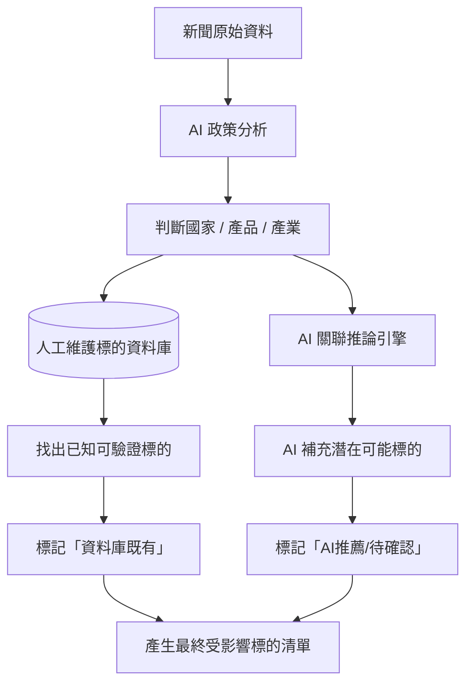
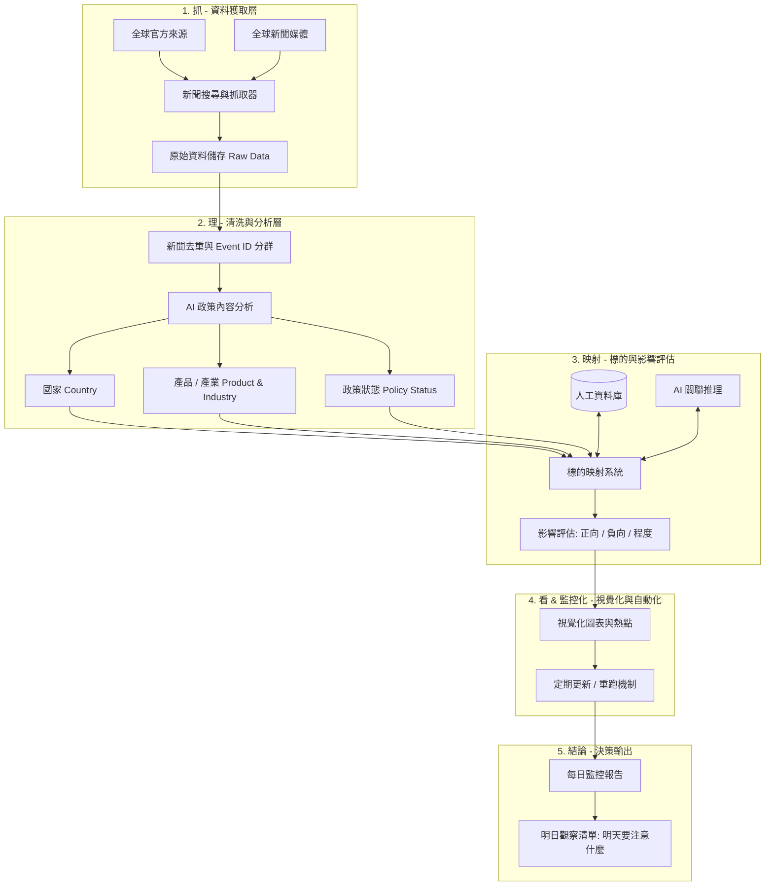

# 第五組｜正式專案計畫
## 關稅政策消息監控系統（新聞來源）
> **核心目標**：每天分類新動態，標出影響哪些全球金融標的，回答「今日關稅政策變化，以及明天需要注意哪些標的」。

---

## 1. 專案主旨

建立一套**全球關稅政策消息監控系統**。

### 核心運作邏輯
1. **持續讀取**：全球各國官方政策資訊 ＋ 全球主要新聞媒體。
2. **自動搜尋與擷取**：過濾並擷取與關稅／貿易政策高度相關的新消息。
3. **資訊結構化轉換**：
   $$\text{政策事件} \longrightarrow \text{國家} \longrightarrow \text{產品} \longrightarrow \text{產業} \longrightarrow \text{標的} \longrightarrow \text{影響方向} \longrightarrow \text{重要程度}$$
4. **每日決策產出**：
   > **「今日關稅政策變化，以及明天需要注意哪些標的」**

本專案完全符合課程指定「抓 $\rightarrow$ 理 $\rightarrow$ 看 $\rightarrow$ 監控化 $\rightarrow$ 結論報告」之要求。

---

## 2. 三項正式決策

### ① 標的不限定台股（擴展至全球金融市場標的）
- **監控範圍**：全球金融市場標的，包含但不限於：
  - 台股、美股、港股、日股、韓股、中國股票
  - ETF、產業指數、大宗商品（Commodities）、其他可識別金融標的
- **待確認細節（保留決策彈性）**：
  - 「標的」是否完整包含股票以外之 ETF、指數、商品、外匯貨幣？（目前確定不侷限於台股上市櫃，其餘視實作逐步擴充）。

### ② 標的映射採「AI ＋ 人工資料庫」混合架構
採用雙軌混合架構，兼顧精準度（避免 AI 幻覺）與擴展性（覆蓋新產業關聯）：



* **人工資料庫（Ground Truth）**：
  * 負責已知、明確、可驗證的產業鏈與公司關聯。
  * *例如：汽車 $\rightarrow$ Tesla, Toyota, Ford, 台灣汽車零組件廠；半導體 $\rightarrow$ TSMC, Intel, Samsung, 設備材料商。*
* **AI 推薦（Discovery）**：
  * 從最新政策脈絡中，發掘尚未建檔或新興的供應鏈關聯。
  * 嚴格標記為 **`AI推薦／待確認`**，降低誤判風險。

### ③ 全球新聞全部納入
- 不侷限單一貿易路徑（如「美國 $\rightarrow$ 台灣」）。
- 全球任兩國或多邊組織之關稅／貿易政策皆納入監控，例如：
  - 美國 $\leftrightarrow$ 中國、美國 $\leftrightarrow$ 歐盟、美國 $\leftrightarrow$ 台灣
  - 中國 $\leftrightarrow$ 歐盟、日本 $\leftrightarrow$ 韓國、印度 $\leftrightarrow$ 美國、墨西哥 $\leftrightarrow$ 美國 ...等。

---

## 3. 系統核心架構



---

## 4. 新聞與政策資訊來源

### 官方來源（Priority 1）
優先鎖定各國政府、貿易談判機構、海關、商務部及財政部門：
- **美國**：The White House、USTR（美國貿易代表署）、U.S. Dept. of Commerce（商務部）、CBP（海關及邊境保衛局）。
- **台灣**：行政院、經濟部（國際貿易署）、財政部（關務署）等相關單位。
- **其他國家**：歐盟委員會（DG Trade）、中國商務部、日本經濟產業省等，隨搜尋動態擴充。

### 全球主要媒體（Priority 2）
- **國際財經媒體**：Reuters、Bloomberg、Financial Times、CNBC、AP、WSJ 等。
- **國內主流財經媒體**：工商時報、經濟日報、中央社等。
- **關鍵搜尋條件**：`tariff` / `trade policy` / `import duty` / `customs duty` / `關稅` / `貿易戰` / `反傾銷稅` 等多語系關鍵詞。

---

## 5. 「新消息」定義與事件分群

- **全量抓取原則**：只要有新發布之相關政策或報導即行抓取。
- **原始資料完整保留**：同一個關稅事件若由不同媒體報導（如 Reuters 報導、Bloomberg 報導、政府公告、國內媒體解讀），4 筆原始資料**全部保存**。
- **Event ID（事件群組）機制**：
  - 系統為每則新聞指派 `News ID`，並透過語意分析指派 `Event ID`。
  - 標記多篇報導屬同一實質事件，避免每日統計與計量時重複計算。

---

## 6. 資料結構規範（Data Schema）

原始資料與 AI 分析結果統一結構化存儲：

| 欄位名稱 | 英文欄位名 | 類型 | 說明 |
| :--- | :--- | :--- | :--- |
| **新聞編號** | `news_id` | String | 唯一識別碼 |
| **事件編號** | `event_id` | String | 聚合同一政策事件之 ID |
| **標題** | `title` | String | 新聞或公告原始標題 |
| **來源** | `source` | String | 媒體名稱或官方機構名稱 |
| **發布時間** | `published_at` | DateTime | 報導或發布時間 |
| **涉及國家** | `countries` | Array | 發起國、受影響國（如 `US`, `CN`, `TW`） |
| **政策措施** | `policy_action` | String | 加徵關稅、配額、豁免、反傾銷等 |
| **稅率資訊** | `tariff_rate` | String | 調整前原稅率／調整後新稅率 |
| **生效日期** | `effective_date` | Date / String | 政策預計生效日或實施期程 |
| **產品項目** | `products` | Array | 具體產品名稱（如電動車、特定晶片、鋼鋁） |
| **HS Code** | `hs_code` | String / Array | 海關稅則編號（若內文或官方公告可取得） |
| **所屬產業** | `industries` | Array | 對應產業別（半導體、汽車、鋼鐵、太陽能等） |
| **政策狀態** | `policy_status` | Enum | 傳聞/研擬中 $\rightarrow$ 正式提案 $\rightarrow$ 正式簽署 $\rightarrow$ 已生效 |
| **相關標的** | `securities` | Array | 受影響之股票代號、ETF、大宗商品等 |
| **影響方向** | `impact_direction` | Enum | `Positive`（利多/轉單受惠）/ `Negative`（利空）/ `Neutral`（中立） |
| **影響程度** | `impact_score` | Integer | 影響強度評分（1 至 5 分） |
| **AI 信心度**| `confidence` | Float / String | 分析判斷可信度評分（High / Medium / Low） |
| **原文網址** | `url` | String | 新聞或官方來源連結 |
| **原始內容** | `raw_content` | Text | 原始全文資料（依要求完整保存，不只留摘要） |

---

## 7. AI 智慧分析層

AI 模組承擔五大核心任務：

1. **關稅主題過濾**：精準鑑別是否為真實關稅/貿易壁壘政策，剔除無關之政治口水或雜訊。
2. **政策狀態精確研判**：區分「研擬/威脅階段」、「公聽會/立法審議」與「正式行政命令/生效生效」，避免市場過度反應。
3. **產業鏈與產品萃取**：建立「關稅措施 $\rightarrow$ 細項產品 $\rightarrow$ 上中下游產業鏈」的層級分解。
4. **受影響標的推薦**：結合人工標的資料庫，並自主推論潛在連帶衝擊標的。
5. **結構化決策摘要**：
   $$\text{發生什麼事} \longrightarrow \text{誰受影響} \longrightarrow \text{影響原因} \longrightarrow \text{後續注意事項}$$

---

## 8. 標的映射系統（Securities Mapping System）

### 三層映射架構

```
【Level 1：資料庫精準匹配】
   新聞提及「汽車關稅」 
   └── 查閱人工資料庫 ──> 自動匹配 Tesla, Toyota, Ford, 東陽, 堤維西...

【Level 2：AI 供應鏈關聯推理】
   AI 根據公司主營產品、產地分布、主要出口市場、大客戶依存度進行推理
   └── 推論出潛在二階供應商或競爭替代者

【Level 3：信心分級標記】
```

### 信心等級標籤

| 標的名稱 | 關聯來源 | 信心等級 | 處理策略 |
| :--- | :--- | :---: | :--- |
| **標的 A** | 人工資料庫直接命中 | **高 (High)** | 直接列入正式監控清單 |
| **標的 B** | 人工資料庫 ＋ AI 交叉驗證 | **中 (Medium)** | 列入重點觀察清單 |
| **標的 C** | AI 新發現 / 擴展推論 | **待確認 (Low/Pending)** | 標註「AI推薦/待確認」，供研究員覆核 |

---

## 9. 影響評估與分類

每個關聯標的皆給予明確的影響性質標籤：

- 🔴 **直接利空（Direct Negative）**：主營產品直接落在課稅清單內，或出口市場面臨高關稅壁壘。
- 🟠 **間接利空（Indirect Negative）**：關鍵客戶受重稅衝擊、原物料成本因關稅上漲，或供應鏈斷鏈。
- 🟢 **潛在受惠（Potential Beneficiary）**：競爭對手國家受重稅打擊，引發轉單效應或本土替代效應。
- ⚪ **待確認（Under Review）**：政策細節未明、豁免條款未定或資料尚不充分。

---

## 10. 每日監控報告結構（Daily Report Blueprint）

每日自動產出「**全球關稅政策日報**」，包含以下核心章節：

1. 📌 **今日重大事件（Top Headlines）**：篩選當日最高影響等級（Level 4～5）之關鍵決策。
2. 🌐 **今日新增政策清單**：按「國家 $\rightarrow$ 政策措施 $\rightarrow$ 涉及產業」清晰條列。
3. 🎯 **受影響標的分級名單**：
   - 直接受衝擊標的（🔴）
   - 間接受衝擊標的（🟠）
   - 轉單受惠標的（🟢）
   - AI 挖掘待確認標的（⚪）
4. 🔥 **全球產業熱點排行（Industry Heatmap）**：
   - *例如：汽車 $\star\star\star\star\star$ ｜ 半導體 $\star\star\star\star$ ｜ 鋼鐵鋁業 $\star\star\star\star$ ｜ 太陽能 $\star\star\star$*
5. 🧭 **明日觀察清單（What to Watch Tomorrow）**：
   - 明確回答：「**明天最需要注意哪些標的與政策進展？**」

---

## 11. 專案驗收里程碑（對應課程五大階段）

| 階段關卡 | 核心驗收指標 | 交付成果 |
| :---: | :--- | :--- |
| **① 抓** | 成功自動擷取全球官方機構與主流媒體之關稅新聞 | 原始資料庫與爬蟲管線 |
| **② 理** | 日期、來源、國家、產品、Event ID 與標的成功結構化 | 清洗後之 JSON/CSV 結構化資料庫 |
| **③ 看** | 產出關稅政策頻率、產業熱點與標的分佈圖表（至少涵蓋兩個以上事件日） | 視覺化圖表、熱力圖與趨勢圖 |
| **④ 監控化** | 具備定時更新／一鍵重跑機制，自動拉取最新資料並更新分析 | 自動化工作流腳本 |
| **⑤ 結論** | 系統每日自動產出具備實質決策價值的「每日監控報告」 | Markdown / PDF 日報產出模組 |

---

## 12. 最終展示與執行流程

現場展示時透過單一命令即可完整重跑並展示全流程：

```bash
python main.py
```

### 現場展示步驟
1. 🌐 **抓取最新新聞**：即時發起查詢並抓取全球官方與媒體最新動態。
2. 🤖 **AI 分類與萃取**：展示對政策狀態、涉及國家、受影響產品之解析。
3. 🏭 **產業鏈比對**：展現自動定位受影響產業之能力。
4. 📈 **全球標的映射**：呈現「人工資料庫 ＋ AI 發現」之三級標籤與信心分級。
5. 📊 **圖表即時生成**：動態繪製關稅熱點圖與受影響標的分佈圖。
6. 📋 **產生每日決策報告**：展示最終產出的 Markdown 監控日報，回答「明天要注意什麼」。

---

## 13. 已確認專案規格總覽

| 規格項目 | 決策結果 | 備註說明 |
| :--- | :---: | :--- |
| **專案名稱** | 關稅政策消息監控系統 | 第五組正式專案 |
| **新聞涵蓋範圍** | 全球 | 不侷限特定區域 |
| **官方來源納入** | 是 | 白宮、USTR、各國商務部與海關等 |
| **新聞媒體納入** | 是 | Reuters, Bloomberg, CNBC, 國內外財經媒體 |
| **監控模式** | 有新消息即抓取 | 持續追蹤最新動態 |
| **同事件多報導** | 全部保留 | 指派相同 `Event ID` 進行聚合與去重 |
| **金融標的範圍** | 全球標的 | 台股、美股、港日韓股、ETF、商品等 |
| **標的映射方式** | AI ＋ 人工資料庫 | 兼具確定性與 AI 探索能力 |
| **每日多維分類** | 是 | 依國家、產業、產品、政策狀態分類 |
| **影響方向標記** | 是 | 🔴直接利空 / 🟠間接利空 / 🟢受惠 / ⚪待確認 |
| **視覺化圖表** | 是 | 涵蓋產業熱點與多事件日分析 |
| **可重複執行** | 是 | 支援 `python main.py` 一鍵重跑 |
| **結論報告輸出** | 是 | 每日自動產出「明日觀察清單」決策報告 |
